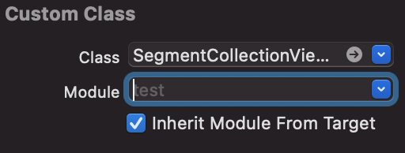

## Installation

### Swift Package Manager

[Swift Package Manager](https://swift.org/package-manager/) is a dependency manager built into Xcode.

If you are using Xcode 11 or higher, go to **File / Swift Packages / Add Package Dependency...** and enter package repository URL **https://github.com/sh-khashimov/RESegmentedControl.git**, then follow the instructions.

To remove the dependency, select the project and open **Swift Packages** (which is next to **Build Settings**). You can add and remove packages from this tab.

> Swift Package Manager can also be used [from the command line](https://swift.org/package-manager/).

### CocoaPods

`RESegmentedControl` is available through [CocoaPods](http://cocoapods.org). To install
it, simply add the following line to your Podfile:

``` ruby
pod "RESegmentedControl"
```

### Manual

You can directly drag and drop the needed files into your project, but keep in mind that this way you won't be able to automatically get all the latest `RESegmentedControl` features (e.g. new files including new operations).

The files are contained in the `Sources` folder.

Make sure that **Inherit Module From Target** is turned on, both for `BackgroundCollectionViewCell.xib` and  `SegmentCollectionViewCell.xib` in your project.

