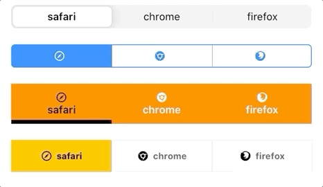
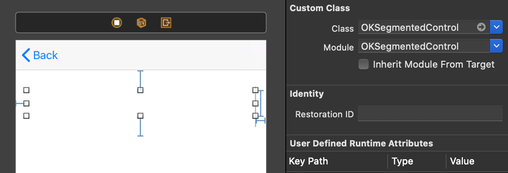
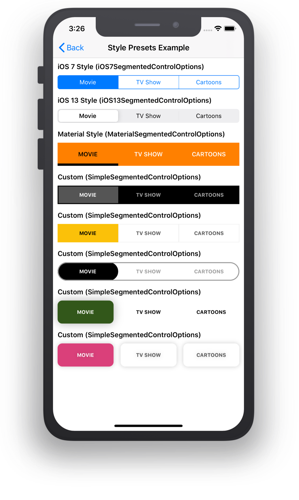
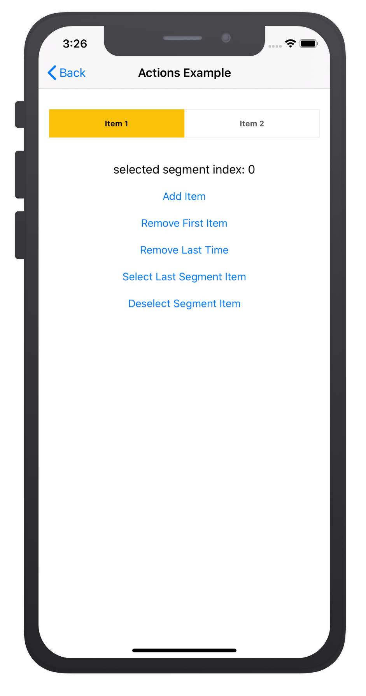
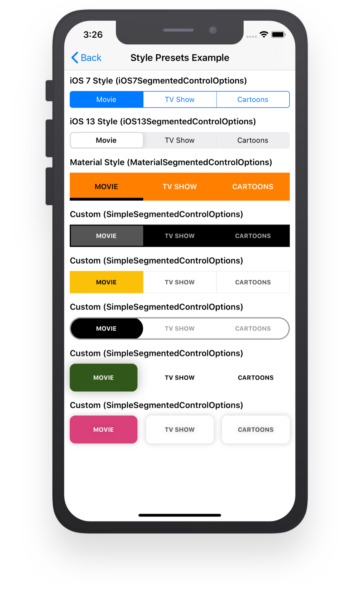

# RESegmentedControl



[](https://travis-ci.org/sh-khashimov/RESegmentedControl)
[](https://cocoapods.org/pods/RESegmentedControl)

[](https://cocoapods.org/pods/RESegmentedControl)


RESegmentedControl is customizable segmented control with style presets. It can display both texts and images, vertically or horizontally, able to download and cache images. It has natural and smooth animation between segments selection. RESegmentedControl also Layout-Driven UI.


## How to use

- Import **RESegmentedControl** to your class:

``` Swift
import RESegmentedControl
```

- Add `UIView` to Storyboard's ViewController. Change class and module to `RESegmentedControl` and @IBOutlet to your ViewController:



``` Swift
/// Segmented Control
@IBOutlet weak var segmentedControl: RESegmentedControl!
```

*or create a `RESegmentedControl` programmatically:*

``` Swift
let segmentedControl = RESegmentedControl(frame: CGRect(x: 0, y: 0, width: 200, height: 44))
self.view.addSubview(segmentedControl)
// TODO: Add segmentedControl Auto-Layouts…
```

- Configure your segmentedControl with items and preset:

``` Swift
// Specify a list of string that will be shown
let titles = ["safari", "chrome", "firefox"]

// Map a list of string to the [SegmentModel]
var segmentItems: [SegmentModel] {
	return titles.map({ SegmentModel(title: $0) })
}

// Create a preset to style the segmentedControl
let preset = BootstapPreset(backgroundColor: .white, selectedBackgroundColor: .black)

// segmentedControl configuration method
segmentedControl.configure(segmentItems: segmentItems, preset: preset)
```

> *To learn more, take a look at the demo project.*

## Layout Types



`RESegmentedControl` initialize with a list of `SegmentModel`. `RESegmentedControl ` could be shown in three ways, with text only, image only or with text and image.

- To show segments with **text**, initiate a `SegmentModel` with `title` variable:

``` Swift
let segmentsItem: [SegmentModel] = [SegmentModel(title: “Title”)]
```
- To show **image**, initiate a `SegmentModel` with `imageName` variable:

``` Swift
let segmentsItem: [SegmentModel] = [SegmentModel(imageName: “imageNameInAseetCatalog”)]
```
initiate a `SegmentModel` with `imageUrl` variable to load **image** from remote server:

``` Swift
let imageUrl = “https://domain.com/image.png”
let segmentsItem: [SegmentModel] = [SegmentModel(imageUrl: imageUrl)]
```
- To show **text** and **image**, initiate a `SegmentModel` with `title` and `imageName`  or `imageUrl` variable:

``` Swift
let segmentsItem: [SegmentModel] = [SegmentModel(title: “Title”, imageName: “imageNameInAseetCatalog”)]

// Image remote location url
let imageUrl = “https://domain.com/image.png”
let segmentsItem: [SegmentModel] = [SegmentModel(title: “Title”, imageUrl: imageUrl)]
```
> *For more information, see `BasicExampleViewController` in the demo project.*

## API



- Dynamically adds item:

``` Swift
func addItem(_ item: SegmentModel, atIndex index: Int? = nil)
```

- Dynamically removes item:

``` Swift
func removeItem(atIndex index: Int? = nil)
```

- Returns segment items count:

``` Swift
var segmentItemsCount: Int
```

- Returns or dynamically changes selected index:

``` Swift
var selectedSegmentIndex: Int
```

- Deselects selected segment item:

``` Swift
func deselect()
```

> *For more information, see `ActionViewController` in the demo project.*

## Presets and Styles



`RESegmentedControl` supports a wide range of customization appearance. It is also possible to apply ready-made presets of styles or create your own preset.

Currently 4 presets are available:

- iOS7Preset - Stylizes to iOS7 system style.

``` swift
struct iOS7Preset: SegmentedControlPresettable
```
- iOS13Preset - Stylizes to iOS13 system style.

``` swift
struct iOS13Preset: SegmentedControlPresettable
```
- MaterialPreset - Stylizes to Material style.

``` swift
struct MaterialPreset: SegmentedControlPresettable
```

- BootstapPreset - Preset with minimal pre-stylization, designed to customize the preset to fit your needs.

``` swift
struct BootstapPreset: SegmentedControlPresettable
```

> *For more information, see `PresetsViewController` in the demo project.*


To learn more about how to create a preset, follow the [**Advanced Style Guide**](/Documentation/Style.md).


## Installation

To learn more see a full <a href="https://sh-khashimov.github.io/RESegmentedControl/" target="_blank">**API Reference**</a>, and check out the demo project included in the repository. When you are ready to install, follow the [**Installation Guide**](/Documentation/Installation.md).

<a name="h_requirements"></a>
## Requirements


| App version              | Swift             | Xcode              | Platforms                                         |
|-------------------|-------------------|--------------------|---------------------------------------------------|
|   current version    | Swift 5.0 – 5.1   | Xcode 10.2 – 11    | iOS 9.0  |

## Contributing
Pull requests are welcome. For major changes, please open an issue first to discuss what you would like to change.

Please make sure to update tests as appropriate.


## Inspiration

- [WWDC 2018: Adding Delight to your iOS App](https://developer.apple.com/videos/play/wwdc2018/233)

## Author

Sherzod Khashimov

## Changelog

See [**changelog here**](/Documentation/Changelog.md)

## License

RESegmentedControl is available under the MIT license. See the LICENSE file for more info.
